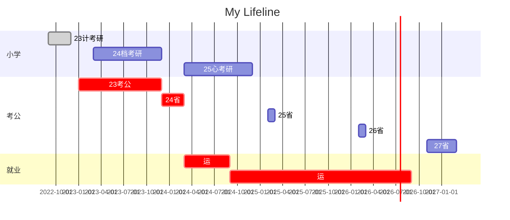

# 极简管理
[[100管理]]

## 时间管理

我的目标变化
小学：画家，发明家，科学家
初中：生物学家，人文地理学家
高中：心理学家，对外汉语教师，中华文化的传播者
大学：电子商务领域的专家，程序员（web前端，Python），电商运营
现在：体制内，会计，审计

### 习惯养成

| 习惯  | 日   | 一   | 二   | 三   | 四   | 五   | 六   |
| --- | --- | --- | --- | --- | --- | --- | --- |
| 公基  |     |     | 1   |     | 1   |     |     |
| 行测  |     |     |     |     |     |     |     |
| 申论  | 1   |     | 1   |     |     |     |     |
|     |     |     |     |     |     |     |     |

## 四大重要事

### 关系：圈子

### 技能：python，GPA，英语，电商

### 财务：月入过万

### 业余：二胡，钢琴，小说

准备把自己这段人生想做的事情全部写下，写完，那也就死而无憾了。

- [ ] 公务员纸质资料全部做完
 
- [ ] 学习并清理完百度网盘的学习资料
 
- [ ] 坚持背单词一年

- [ ] 不背单词单词清零
 
- [ ] 考研上岸

- [ ] 事业编上岸

- [ ] 公务员上岸

- [ ] 找到工作

- [ ] 月入过万

- [ ] 个人网站实现番茄钟功能

- [ ] 个人网站实现多个进度条功能

- [ ] 个人网站实现文章管理功能

- [ ] 个人网站实现标签词云

- [ ] 个人网站实现数据可视化看板

- [ ] 发布个人网站

- [ ] 购买一个midi键盘

- [ ] 学会弹卡农

- [ ] 发布自己的一首纯音乐钢琴曲

- [ ] 发布一首完整的纯原创歌曲

- [ ] 买一个二胡

- [ ] 学会拉二泉映月

- [ ] 拥有自己的一项可盈利的专利

- [ ] 经营一个有稳定月销量的网店

- [ ] 出版一本书

- [ ] 炒股

- [ ] cpa证书

- [ ] 心理咨询师证书

- [ ] 中职电子商务教师证

- [ ] 导游证

- [ ] 计算机二级

- [ ] 翻译证书

## 手机管理

## 电脑管理

## 一年一句

